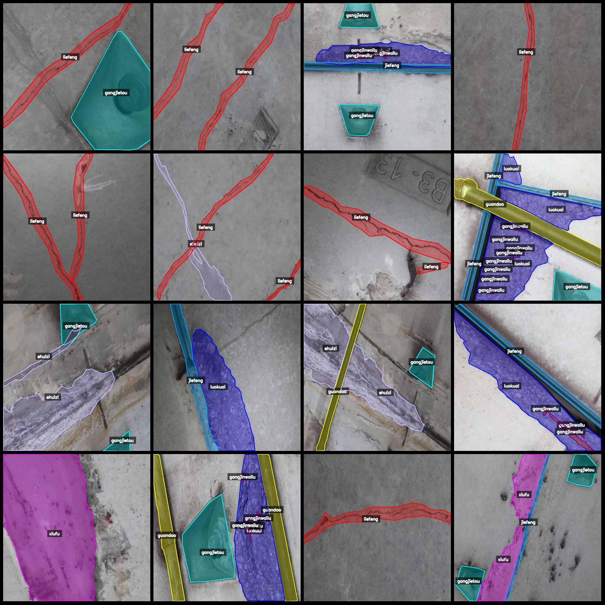
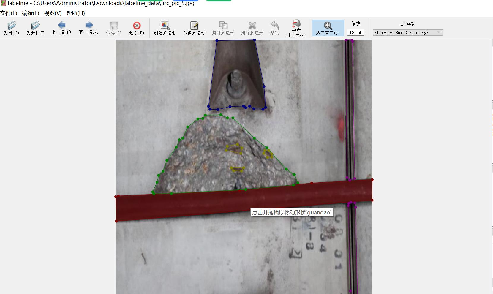

# Tunnel Wall Defects, Concrete Defects, Tunnel Cracks, Rebar Exposure Identification and Segmentation Dataset with 1216 Images in 10 Categories with Enhanced Capabilities

Note: Approximately one-third of the data is original images, with the remaining being 1:2 enhanced imagery. The primary focus is on viewing the images.

Dataset format: labelme (without mask files, only containing JPG images and corresponding JSON files).

Number of images (JPG file count): 1216

Number of annotations (JSON file count): 1216

Number of annotation categories: 10

Annotation category names: ["biaoji", "gangjietou", "gangjinwailu", "guandao", "jiefeng", "liefeng", "luokuai", "shuizi", "wuzi", "xiufu"]

["Tag", "Welded Joint", "Bar Bracket Exposed", "Pipe", "Seam", "Crack", "Dropout", "Stain", "Dirt", "Repair"]

Each category annotations:

- biaoji: 1
- gangjietou: 923
- gangjinwailu: 827
- guandao: 442
- jiefen: 831
- liefen: 918
- luokuai: 650
- sheizi: 480
- wuzi: 183
- xiufu: 175

Total boxes: 5430

Labelme version used: 5.5.0

Image resolution: 640x640

Annotation rules: Polygons are drawn around each category.

Important note: You can open and edit the dataset using labelme. For JSON datasets, you need to convert them into mask, yolo, or coco format for semantic segmentation or instance segmentation.

Special notice: This dataset does not guarantee any precision in the training of models or weights files.

Image previews:

Example of an annotated image (randomly selected 16 images):

Annotation drawing results:

Labelme editing example image:
## Image

Here is a pay link on Stripe ( https://buy.stripe.com/3cs8yP7sY87d0vu9AB ). Please contact me lonlonago@foxmail.com after funding $89, and I will send you a complete data files , thank you!

